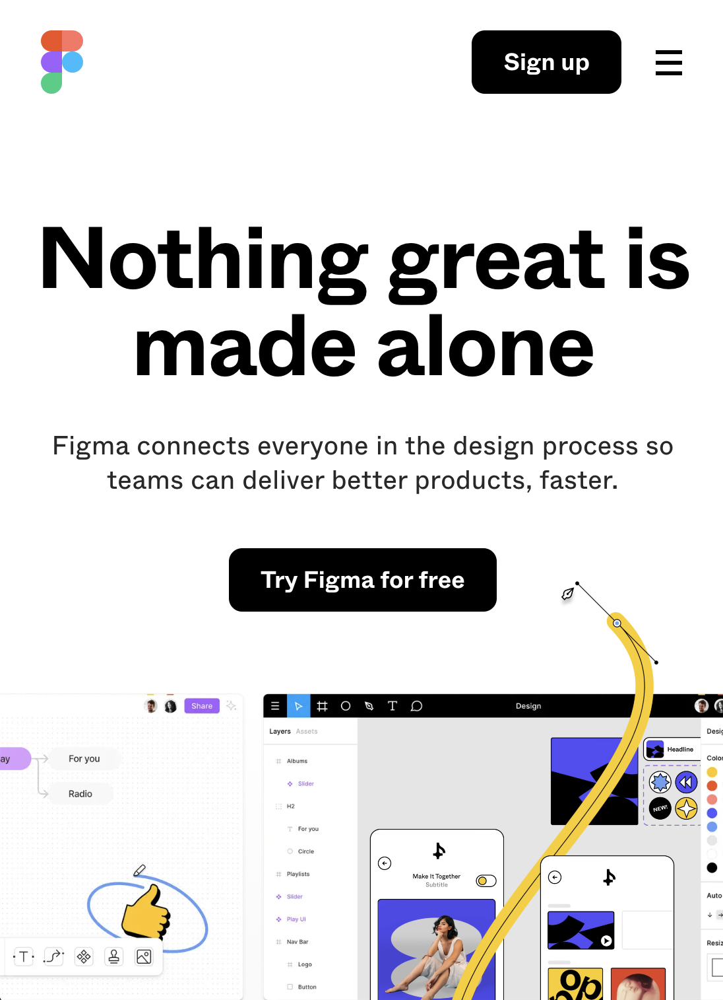
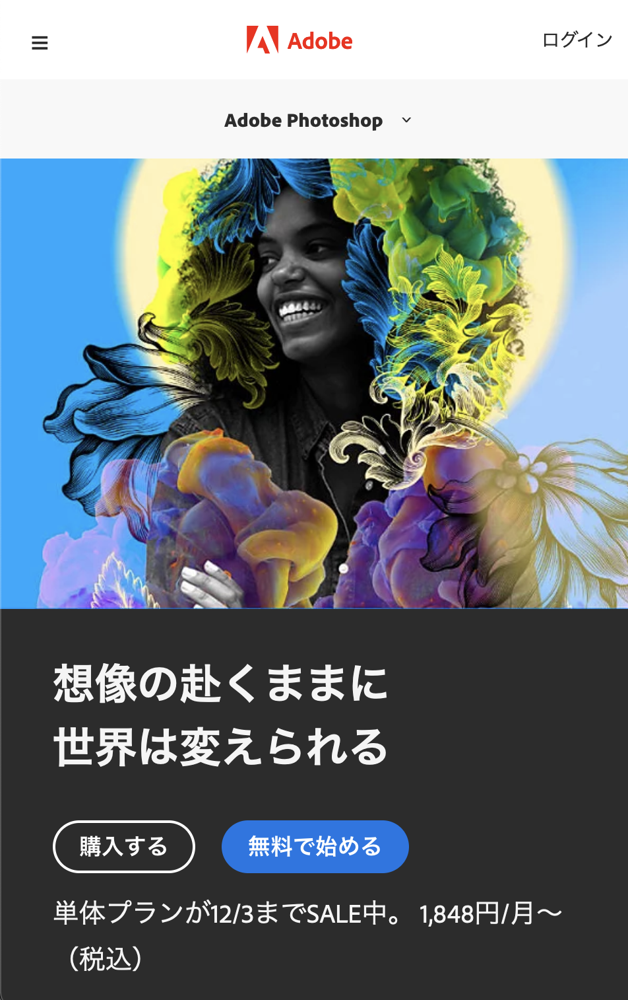
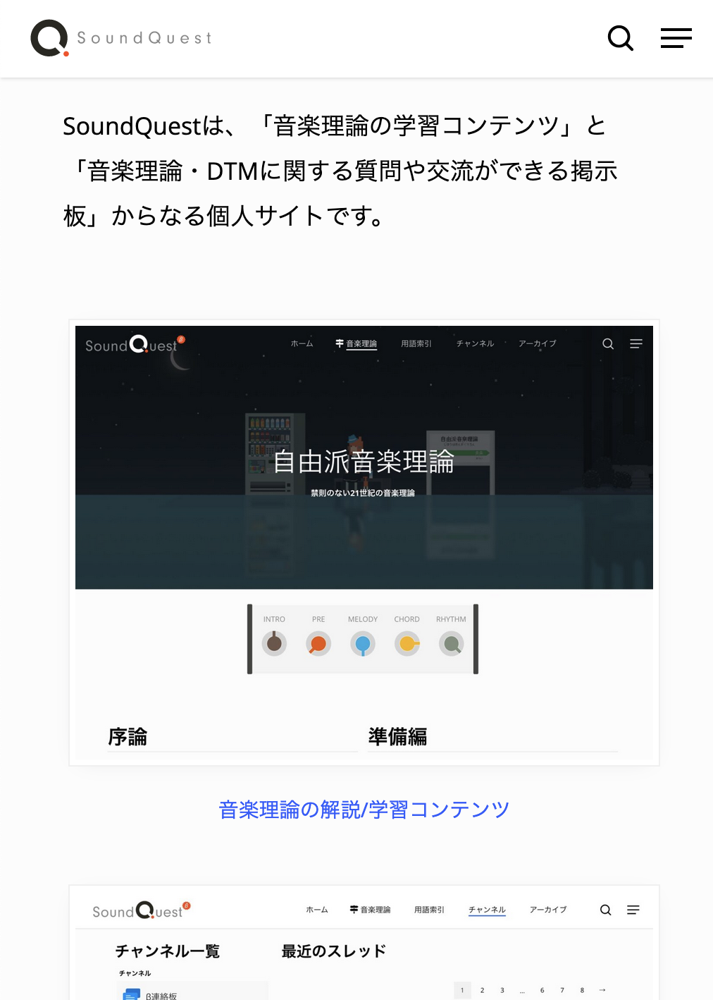
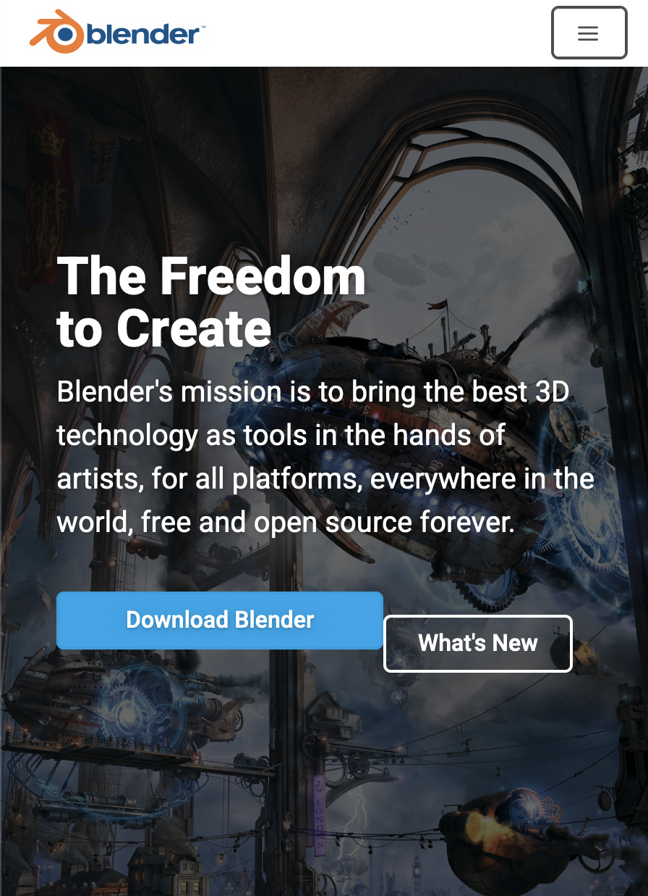

<!-- _class: title -->

# とにかく楽して自主制作

## 何も考えたくない

<!--
_color: white
_footer: 'Photo by Earl Lasala on Unsplash'
-->

---

## 何か作れと言われても

-   何を作ればいいかわからん
-   どうやって作ればいいのかわからん
-   調べ方わからん

-   **めんどい**

<!--
_footer: '©︎ 4418'
-->

---

## とにかく楽して終わらせるために

必要なポイント

-   何がどう言うふうに作れるか知る
-   便利なツールを知る
-   省ける作業は省く
-   苦しいことは避ける

<!--
_footer: '©︎ 4418'
-->

---

## 自主制作の例

**制限 Mac でできる、現実的なもの**

-   イラストやデザイン制作
-   画像編集
-   動画編集(ちょっとめんどい)
-   Web 制作(ちょっとめんどい)
-   音楽制作(ちょっとめんどい)

**やろうと思えばできるけど非現実的なやつ**

-   プログラミング
-   3D CG 制作

<!--
_footer: '©︎ 4418'
-->

---

## イラストやデザインに便利なツール

**Figma**
Adobe 系と異なり、**無料**で使える。
Web 上で使えるので、制限 Mac でも Windows でも使える。

<!--
_footer: '©︎ 4418'
-->

---

## イラストを楽して作りたい

**Photoshop**
さすが Adobe といえるような高度な機能が付いている。
(制限 Mac でやるのはスペック的におすすめしないが。)

 
Adobe Photoshop 2022の新機能を使って芸術作品を生成する。

<!--
_footer: '©︎ 4418'
-->

---

## 音楽を作りたいけど

何を参考にすればわからないという時

**SoundQuest**と言うサイトが便利。**無料**

<!-- ここ -->
<!-- https://soundquest.jp/about/ -->

<!--
_footer: '©︎ 4418'
-->

---

## もしプログラミングがしたければ

制限 Mac ですぐに使うことができる言語は

-   Python
-   Ruby

のみで、他の言語を使いたいというときはかなり面倒になる。

Python でやるおすすめのやつ

-   **LINE の BOT**

---

## 3D モデル作りたいけど...

**Blender**というソフトを使うのが一番手軽だが、制限 Mac に入れるのは少々面倒。
(ICT に行けば多分入れてくれる。)

Blender の使い方は YouTube で調べれば大量に出てくるのでそれを見ればどうにかなる。

---

## 3D モデルを
