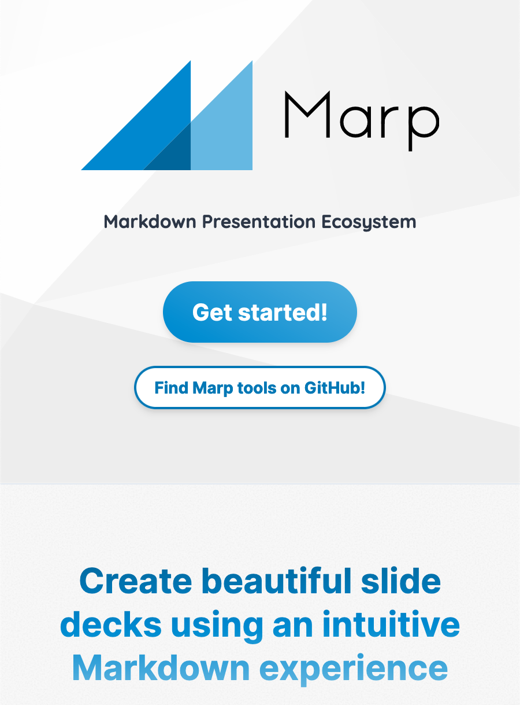
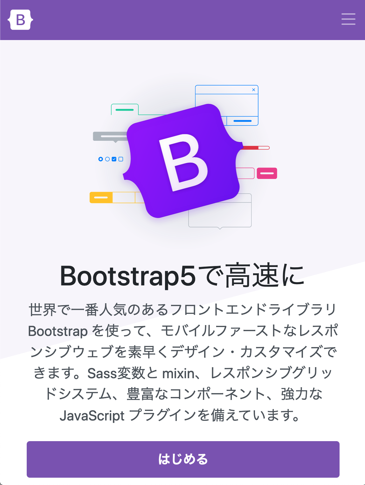

<!-- _class: title -->

# とにかく楽をしたい！

## 生活を向上させるツールの紹介

<!--
_color: white
_footer: 'Photo by Earl Lasala on Unsplash'
-->

---

## 楽をしたい

-   何かやりたいけど何ができるのかわからない

-   どうやればいいのかわからない

---

## とにかく楽して終わらせるために

必要なポイント

-   何がどう言うふうに作れるか知る
-   便利なツールを知る
-   省ける作業は省く
-   苦しいことは避ける

---

## 作るものの例(情報系で)

-   イラストやデザイン制作
-   画像編集
-   動画編集(ちょっとめんどい)
-   Web 制作(ちょっとめんどい)
-   音楽制作(ちょっとめんどい)
-   プログラミング(めんどい)
-   3D CG 制作(難しい)

---

## イラストやデザインに便利なツール

**Figma**
Adobe 系と異なり、**無料**で使える。
Web 上で使えるので、制限 Mac でも Windows でも使える。

---

## スライドを楽に作りたい

-   **PowerPoint**は重い

**Marp**という VSCode のプラグインを使うことで、VScode 上で軽量にスライドを作ることができる。**無料**
このスライドも Marp で作成されている。

-   Markdown というマークアップ言語を使う必要がある

---

## 文章を書きたくない

**AI のべりすと**を使うと、文章の冒頭部分を与えるだけで、続きを AI に作ってもえる。**無料**

---

## イラストを楽して作りたい

**Photoshop**にはさすが Adobe といえるような高度な機能が付いている。
(制限 Mac でやるのはスペック的におすすめしないけど。)

 
Adobe Photoshop 2022の新機能を使って芸術作品を生成する。

---

## 音楽を作りたい

何を参考にすればわからないという時

**SoundQuest**と言うサイトが便利。**無料**

## おすすめのソフト

Mac や iOS デバイスで使える、**GarageBand**がおすすめ。**無料**

<!-- ここ -->
<!-- https://soundquest.jp/about/ -->

---

## プログラミングがしたかったら

制限 Mac でそこまで準備せずに使うことができる言語は

-   Python
-   Ruby(おすすめしない)

Python でやるおすすめのもの

-   **LINE の BOT**
-   スクレイピング
    サイトから画像などのデータを自動でダウンロードするやつ

---

## 実は LINE の BOT は簡単に作れる

LINE には「公式アカウント」と呼ばれるアカウントがあるが、自動で返信してくるやつを BOT という。

左の BOT は Node.js で作られているが、Python でも同じことができる)

 

送られたメッセージに対して返答するという基本的な機能に加えて、ボタンや画像を送信することもできる。

---

## コードが書くのが面倒...

**Copilot**という VSCode の拡張機能を使えば、AI がコードを書くことを手伝ってくれる。

どういうことをしたいのかをコメントに書くことで、AI がコードを補完してくれる。

※Copilot の利用には登録申請が必要

---

## CSS 書きたくない

**Bootstrap**というものを使うことで、CSS をあまり書かずに Web サイトの見た目をよくすることができる。

ググると情報がいっぱい出てくる。

---

## 3D モデル作りたいけど...

**Blender**というソフトを使うのが一番手軽だが、制限 Mac に入れるのは少々面倒。
(ICT に行けば多分入れてくれる。)

Blender の使い方は YouTube で調べれば大量に出てくるのでそれを見ればどうにかなる。

---

## 3D スキャンソフトを使って楽をしたい

iOS デバイス用のスキャンソフトがたくさんある。
**LiDAR** 搭載デバイスがあると**Scaniverse**というアプリが使える

-   iPhone 12 Pro, Pro Max
-   13 Pro, Pro Max

LiDAR が搭載されていない iOS デバイスでは少し厳しい。
(Android の人は**Matterport**というアプリもあるが、iOS に比べると数が少ない)

---

## 3D スキャンした様子

-   細かいところは荒いが、大まかな形は取得できる
-   このモデルを Blender に転送して、いろいろと調整することもできる

---

### Blender に転送した様子

---

# 終わり

こういう感じの様々な便利ツールを活用すると色々と楽になるので、どんどん活用して生活を向上させよう！
